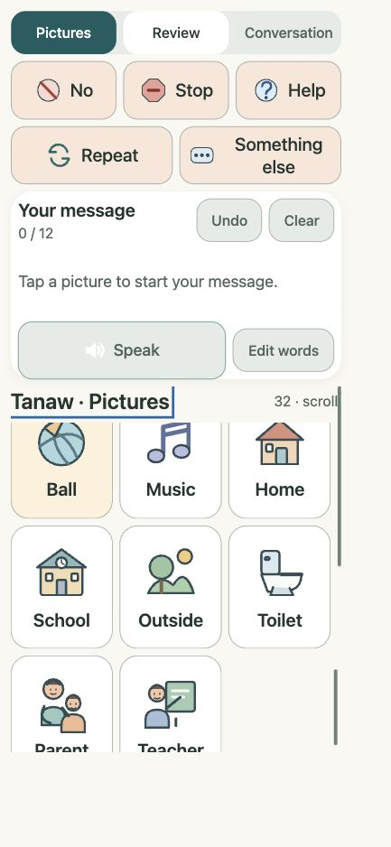
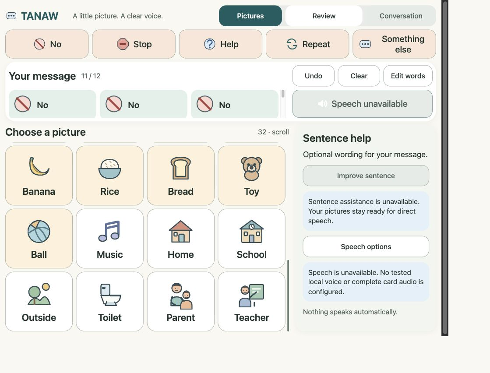

# Issue #3: direct AAC checkpoint

Owner: RobinKielll. Branch: `task/issue-3`, one existing repository folder, based on main `d4d7e33`.

Design gate: [Heiron8's actual approval](https://github.com/Heiron8/hackathon-appbuilders-walangkamatayantilapia/issues/2#issuecomment-6087693386) and [fresh independent Design QA PASS recorded on Issue #2](https://github.com/Heiron8/hackathon-appbuilders-walangkamatayantilapia/issues/2#issuecomment-6087806342). Both were verified before coding. Existing [Figma foundation](https://www.figma.com/design/SBBf5c8ejKjxcW70Fyw29N?node-id=26-10) remains the reference.

## Delivered scope

Empty-start picture board with all 32 canonical IDs in fixed order, five essential responses, selection-order appends and intentional repeats, 12-word limit, Undo, explicit Remove/reorder and confirmed Clear. Speak, Stop audio and Replay call the existing speech helper only after user action. Optional sentence help is truthfully unavailable; Conversation is disabled. No inference candidate is invented. Selection changes invalidate the future candidate/approval/request state.

Existing speech runtime, inference/backend, shared vocabulary/contracts and dependency manifests are unchanged. Product verification replaces its obsolete placeholder-text assertion with actual React mount/module checks; health, proxy, scoped filesystem, static serving and backend-stop checks remain intact. Actual browser rendering is separately verified.

## Independent evidence

Separate read-only Codex review: **PASS for this checkpoint**, with focus and phone-label corrections fixed and re-reviewed. [Full unchanged reviewer report](issue3-checkpoint1-review.md). Actual CSS viewports checked: phone 390×844, narrow phone 320×640, tablet 1024×768 and desktop 1440×900. No horizontal overflow or broken pictures; all 32 IDs remain in canonical order. Figma exports are locally bundled, preserve original SVG bytes/dimensions and do not require MCP URLs at runtime.

Archived independent rendered evidence:





Canonical `python scripts/verify.py --ci` passed on October 10, 2026: workspace/governance tests and secret scan, 45 frontend tests, production build, Python dependency compatibility, 16 backend/launcher tests, and real loopback smoke (health/proxy, final static assets/reload, scoped file access, frontend shell/vocabulary after backend stop, both ports released). Root used the existing backend virtual environment through PATH. These mechanical checks do not certify physical offline audio.

## LOQ speech configuration

The exact local English voice URI was retrieved from [Gab/Earl's immutable device evidence](https://github.com/Heiron8/hackathon-appbuilders-walangkamatayantilapia/blob/3fd47c076aad4c5ec4abeb2ef04bdc857eda8ca7/docs/qa/evidence/2026-10-10-loq-assets.json): `Microsoft Zira - English (United States)`, LOQ / Windows 11 / Chrome 154, Gab tester and Robin reported witness. This is the existing human-confirmed voice check, not a new integrated React audio PASS.

On that verified laptop, opt in explicitly before starting the existing launcher:

```powershell
$env:VITE_TANAW_SPEECH_PROFILE = "loq-zira"
python scripts/dev.py
```

For final local static serving, set the same variable before `npm.cmd run build` in `frontend`, then follow `docs/development.md`. The helper still requires the exact installed local English voice. Default/unknown profiles remain unavailable. No recordings are configured: PR #15 is not merged here, and its fallback checks remain pending. Other devices require their own offline check; do not opt them in merely because a voice has the same name.

Physically disconnect the LOQ laptop's internet, keep the loopback server running, select Want → Eat → Apple and explicitly Speak. Witness complete audible output, Stop audio, Replay, intentional repeats and restart/reload with Ollama stopped. Record the integrated commit/device/browser/witness and actual results on Issue #3. Native completion events and fixture tests do not prove audible playback.

## Next checkpoint and remaining acceptance

Integrate optional sentence improvement when the approved API is available, keeping original words visible and approval separate from speech. Implement actual loading/failure/stale-response handling and invalidate approval on card edits. Conversation stays disabled. Issue #3 remains open after this small PR.

Integrated offline audio, device checks and recognition/redistribution evidence for these specific Figma pictograms remain pending. PR #15's different symbol audits do not certify these exports. The dedicated implementation worker was a Codex subagent; native Codex thread creation was unavailable, so no separate app thread is claimed.
